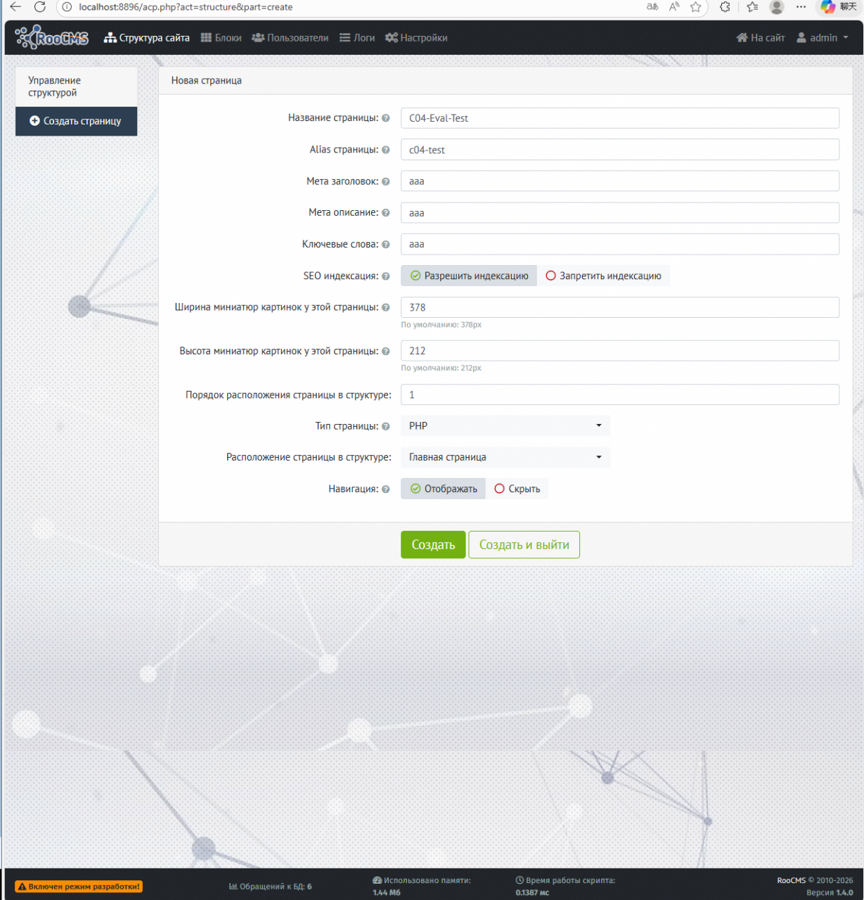
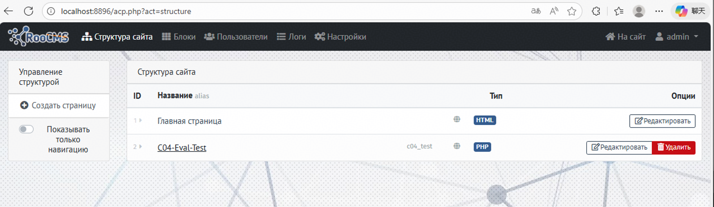
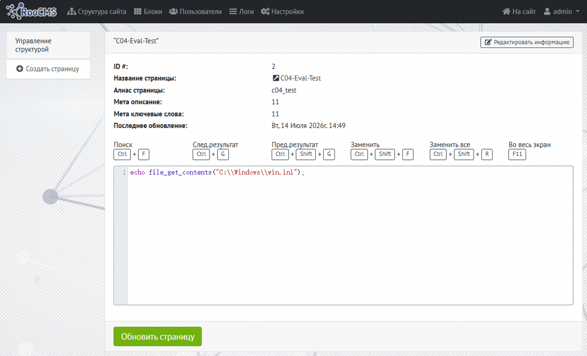
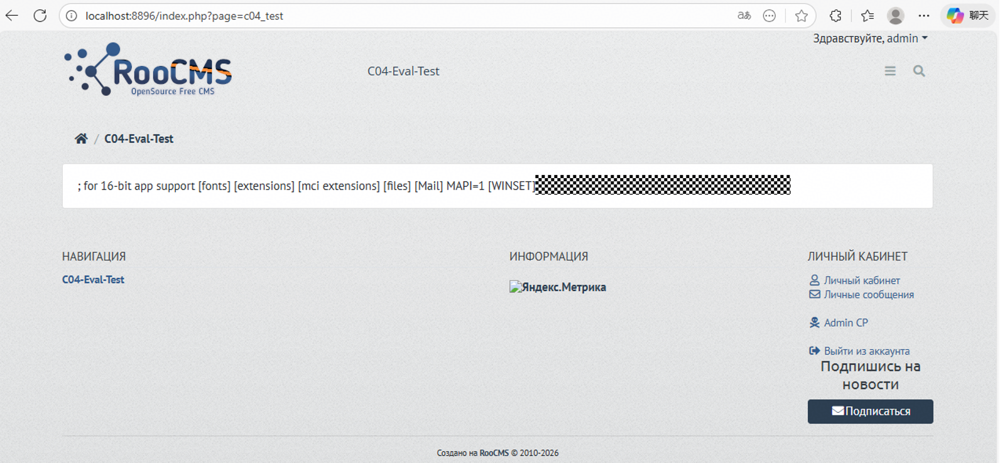

# RooCMS <= 1.4.0 - eval() Function Remote Code Execution Vulnerability
## Vulnerability Information
| Field | Value |
| --- | --- |
| **Product** | RooCMS |
| **Affected Versions** | <= 1.4.0 |
| **Link** | [https://github.com/RooCMS/RooCMS](https://github.com/RooCMS/RooCMS) |
| **Vulnerability Type** | Remote Code Execution (RCE) |
| **Authentication Required** | Yes |


## Vulnerability Description
RooCMS uses `eval()` to execute PHP page and PHP Block content stored in the database. The application encodes user input via `escape_string()` before writing to the database, but during frontend rendering, `$parse->text->html()` restores all encodings before `eval()` execution. The HTML entity mappings of `htmlspecialchars()` / `htmlspecialchars_decode()` and `str_ireplace()` form perfect inverse pairs, providing no protection against `eval()` injection. An attacker with admin privileges can inject and execute arbitrary PHP code, achieving full server control.

## Vulnerable Code
### Attack Surface 1: PHP Page Rendering
**File:** `roocms/site_pagePHP.php`, line 47

```php
ob_start();
    eval($parse->text->html($data['content']));
    $output = ob_get_contents();
ob_end_clean();
```

When a user accesses a page of type `page_type=php`, the `PagePHP` class is automatically instantiated, reads content from the database `roocms_pages__php.content` column, decodes it, and passes it directly to `eval()` for execution.

### Attack Surface 2: PHP Block Rendering
**File:** `roocms/site_blocks.php`, line 54

```php
eval($parse->text->html($data['content']));
```

This is triggered when `$blocks->load()` is called in the template to load a `block_type=php` Block, reading content from the database `roocms_blocks.content` column and executing it via eval.

### Encoding (Write Path) — No Effective Protection
**File:** `roocms/class/class_db_mysqli.php`, lines 443-457

```php
public function escape_string(string $q) {
    $q = htmlspecialchars($q);
    $q = str_ireplace(
        array('{','}','$','&amp;gt;','\''),
        array('&#123;','&#125;','&#36;','&gt;','&#39;'),
        $q);
    if($this->db_connect) {
        return $this->sql->real_escape_string($q);
    }
    else {
        return $q;
    }
}
```

### Decoding (Read Path) — Complete Restoration Before eval
**File:** `roocms/class/class_parserText.php`, lines 37-54

```php
public function html($text) {
    if(is_array($text)) {
        foreach($text AS $k=>$v) {
            $text[$k] = $this->html($v);
        }
    }
    else {
        $text = htmlspecialchars_decode($text);
        $text = str_ireplace(
            array('&#123;','&#125;','&#39;','&#36;','&#036;','&#33;','&#124;','...'),
            array('{','}','\'','$','$','!','|','&hellip;'),
            $text);
    }
    return $text;
}
```

### ACP Write Entry Point
**File:** `roocms/acp/pages_php.php`, lines 57-61

```php
public function update($data) {
    global $db, $logger, $post;
    $db->query("UPDATE ".PAGES_PHP_TABLE." SET content='".$post->content."', date_modified='".time()."' WHERE sid='".$data->page_sid."'");
}
```

## Data Flow Analysis
The encoding mechanism of `escape_string()` was designed for XSS protection in HTML output scenarios. When the same data is consumed by `eval()` rather than HTML rendering, `html()` decoding fully restores the original PHP code, rendering the encoding completely ineffective as a security control.

| Character | `escape_string()` Encoded | `html()` Restored | Reversible |
| --- | --- | --- | --- |
| `<` | `&lt;` | `<` | Yes |
| `>` | `&gt;` | `>` | Yes |
| `"` | `&quot;` | `"` | Yes |
| `&` | `&amp;` | `&` | Yes |
| `{` | `&#123;` | `{` | Yes |
| `}` | `&#125;` | `}` | Yes |
| `$` | `&#36;` | `$` | Yes |
| `'` | `&#39;` | `'` | Yes |


PHP syntax critical characters (`$`, `{`, `}`, `<`, `>`, `'`, `"`) can all be perfectly restored, making arbitrary PHP code injection and execution possible.

## Vulnerability Verification (PoC)
### Prerequisites
+ ACP administrator credentials
+ Target server running RooCMS v1.4.0

### Step 1: Create a PHP-type Page
1. Log in to ACP backend at `http://localhost:8896/acp.php`
2. Visit [http://localhost:8896/acp.php?act=structure&part=create](http://localhost:8896/acp.php?act=structure&part=create)
3. Fill in the form:
    - Название (Title): C04-Eval-Test
    - Алиас (Alias): c04-test
    - Тип страницы (Page Type): Select **PHP**
4. Click "Создать" to create



### **Step 2: Edit PHP Page Content**
1. Visit http://localhost:8896/acp.php?act=structure
2. Find `C04-Eval-Test`, click the edit button, navigate to page [http://localhost:8896/acp.php?act=pages&part=edit&page=2](http://localhost:8896/acp.php?act=pages&part=edit&page=2)
3. Enter the following in the editor:

```php
echo file_get_contents("C:\\Windows\\win.ini");
```



4. Click "Обновить" to update

### **Step 3: Trigger eval Execution on Frontend**
1. Visit in a new tab: [http://localhost:8896/index.php?page=c04_test](http://localhost:8896/index.php?page=c04_test)
2. Observe the page output

**Verification Result**:

```plain
; for 16-bit app support [fonts] [extensions] [mci extensions] [files] [Mail] MAPI=1 [WINSET] *************
```

eval code execution confirmed, win.ini contents echoed as follows




## Impact
+ **Arbitrary Code Execution:** An attacker can execute arbitrary PHP functions such as `system()`, `shell_exec()`, `exec()`, `passthru()`, `proc_open()`, etc., to run OS commands with the web server user's privileges
+ **Full Server Control:** Read/write arbitrary files, extract credentials from database configuration files, install persistent backdoors
+ **Lateral Movement:** Use the compromised server as a pivot to attack other systems in the internal network
+ **Persistent Backdoor:** PHP code stored in the database is executed on every page visit, leaving no traces on the filesystem, making detection and forensics difficult
+ **Attack Chain Amplification:** Can be combined with vulnerabilities such as weak password brute-forcing to achieve unauthenticated remote code execution

## Remediation Recommendations
1. Implement a strict PHP function whitelist mechanism
2. Configure `disable_functions` in `php.ini` to disable dangerous functions (`system`, `exec`, `shell_exec`, `passthru`, `popen`, `proc_open`)
3. Set `open_basedir` to restrict filesystem access scope
4. Add CSRF protection and secondary authentication for ACP operations that modify PHP pages/Blocks
5. Log the complete code content executed by `eval()` and the operator information for all executions

